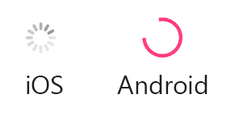

# React native modal spinner #

     
# INSTALLATION

* npm i react-native-spinner-modal

# Images
##

# Example

  import {Spinner} from "react-native-spinner-modal"

    <View >
	  ...
      <Spinner  size={"small"} color={"red"} visible={true} />
	  
	  
	  </View>
    

------------
## Development

Harish React native Development  

-------------